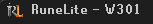

# World Title

World Title adds your current OSRS world to the RuneLite window title.

This is useful when you run multiple RuneLite clients, record gameplay, stream, or alt-tab between clients and want the active world visible from the operating system window title.

## Features

- Shows the current world in the RuneLite title bar.
- Keeps the world suffix applied after alt-tabbing away and back.
- Updates after world hops.
- Works with RuneLite's `Show display name in title` setting enabled or disabled.
- Optional world activity display, such as `Trade` or `Wintertodt`.
- Optional region display after the world or activity, such as `(US)` or `(UK)`.
- Optional player count display, such as `842 players`.
- Optional membership display, with full, short, or unwrapped styles.
- Configurable separator for title details:
  - `W301 - Trade`
  - `W301 | Trade`
  - `W301: Trade`
- Configurable world format:
  - `W301`
  - `World 301`
  - `[301]`
  - `301`

## Examples



```text
RuneLite - PlayerName - W301
RuneLite - PlayerName - W301 - Trade - Free
RuneLite - PlayerName - W307 - Wintertodt (Members)
RuneLite - PlayerName - W307 - Wintertodt (UK) (Members)
RuneLite - PlayerName - W301 | Trade (US) | 842 players
RuneLite - W301
```

## Configuration

Open RuneLite's plugin settings and search for `RuneLite`. In window settings, make sure `Enable custom window chrome` is enabled.

Open RuneLite's plugin settings and search for `World Title`.

Available settings:

- `World format`: controls how the world number is displayed.
- `Show world activity`: appends the current world's listed activity when available.
- `Show world region`: appends the current world's region when available.
- `Show player count`: appends the current world's player count when available.
- `Show membership type`: appends whether the world is free-to-play or members.
- `Membership style`: controls how free-to-play and members worlds are displayed.
- `Separator`: controls the separator used between world title details.

## Notes

World activity and membership data comes from RuneLite's existing world list service. If that data has not loaded yet, the plugin may briefly show only the world number and update once RuneLite receives the world list.

## Other Plugins

Check out my other RuneLite plugins:

- [Area Loot](https://github.com/Aiirik/AreaLoot) - Shows nearby ground loot in a panel and highlights selected item locations.
- [Chat Highlight Player](https://github.com/Aiirik/chathighlightplayer) - Highlights players by clicking their names in chat.
- [Player Examine](https://github.com/Aiirik/PlayerExamine) - Shows visible equipment and combat info for examined players.
- [Private Message Fade](https://github.com/Aiirik/PrivateMessageFade) - Hides split private chat after a configurable idle delay.
- [Staff Rune Overlay](https://github.com/Aiirik/StaffRuneOverlay) - Shows rune overlays for elemental and combination staves.

## Change log

Click to view the <a href="https://github.com/Aiirik/WorldTitle/blob/master/CHANGELOG.md">CHANGELOG</a>
